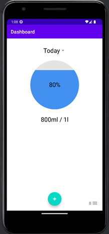
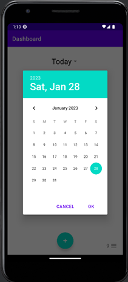
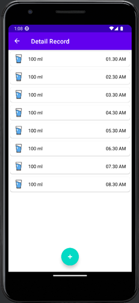

# JustWater
Compared to earlier eras, people today are busier at work. They neglect their daily water intake because of this. Indirectly, there is a sharp rise in the number of health issues. As a result, the mobile application – JustWater is developed to help user keep track of their daily water intake. This application was created to remind users to drink enough water each day and help prevent illnesses brought on by dehydration.

## User Interface
|Main Screen |Calender| Detailed Record|
|-|-|-|
||  |  |

## Installation
1. Clone this respository
2. Use as Android Studio to open the project just cloned
3.  Sync the project and download the necessary dependencies
4. Use Android Studio's build functionality to compile the project
5. In the Android menu, go to Build > Build Bundle(s) / APK (s) > Build APK(s).
6. After a successful build, the generated APK file can be found in the project's output directory. By default, the APK file is located in the app/build/outputs/apk/ directory
7. Install the compiled apk in your android device.